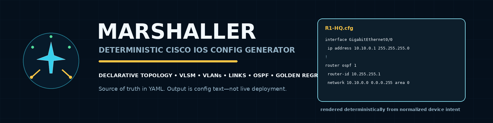
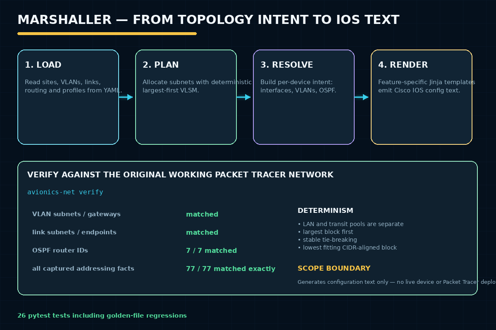

# Marshaller — Cisco IOS Config Generator



*Ships as the `avionics-configgen` CLI/library — see below.*


## Overview

The original version is a Cisco Packet Tracer simulation of a
multi-site aviation-base network: a headquarters site connected to four
factory sites via routed point-to-point links, using OSPF for dynamic
routing and department-level VLAN segmentation — hand-configured in the
Packet Tracer GUI and verified with real captured `show` command output.

**New addition:** [`configgen/`](configgen/), a declarative Cisco IOS
configuration generator that treats this same network as YAML data
instead of hand-typed CLI: a VLSM-capable IP planner, a
device-independent resolved config model, feature-specific Jinja
templates, and a `verify` command that regenerates the real network's
addressing and reproduces **all 77** of its captured facts (VLAN
subnets/gateways, link subnets/endpoints, 7 directly-observed OSPF
router-ids) exactly. See [`configgen/README.md`](configgen/README.md)
for the full design.

## Problem Statement

Design and verify a realistic multi-site enterprise network — dynamic
routing between sites, VLAN segmentation within sites, and working
DNS/FTP/Web/Mail services — entirely in simulation. *(New: and prove that
network's configuration can be generated deterministically from a
declarative model rather than hand-typed, without discarding the
original verified engineering.)*

## Objectives

*(original)*
- Connect HQ and 4 factory sites via routed point-to-point (/30) links.
- Run OSPF area 0 across all routers for dynamic routing.
- Segment ~20 departments into VLANs on separate /24 subnets.
- Verify DNS, FTP, Web, and Mail service reachability from factory sites.

*(this rebuild)*
- Model the real topology declaratively and generate its IOS
  configuration deterministically.
- Prove the generator is faithful by reproducing the real network's own
  captured addressing facts exactly, not by inventing new ones.
- Separately prove the VLSM allocator itself is correct, without
  overfitting a tie-break policy to the real (non-VLSM) historical
  numbering.

## Tools and Technologies

- Cisco Packet Tracer, OSPF (area 0), VLANs, 802.1Q trunking, Cisco IOS CLI *(original)*
- **New:** Python 3.12, Jinja2, `ipaddress`, JSON Schema, pytest, Ruff, GitHub Actions

## Features

*(original)*
- HQ site: firewall, main router, distribution switch, DNS/FTP/Web/Mail servers.
- 4 factory sites (AMF, APF, ARF, MRF) each routed to HQ.
- ~20 VLANs across 192.168.10.0/24–200.0/24.
- Verified OSPF adjacencies and end-to-end service reachability.

*(this rebuild — see `configgen/README.md` for full detail)*
- A deterministic largest-first VLSM allocator with stable tie-breaking
  and lowest-available-block assignment, unit-tested against Cisco's own
  published VLSM example values.
- A declarative YAML topology schema (address pools, sites, devices,
  VLANs, links, routing) validated both structurally (JSON Schema) and
  referentially (no dangling links, no interface claimed twice, no
  VLAN-gateway/manual-interface collisions).
- A device-independent resolved config model and feature-specific Jinja
  templates (interfaces, VLANs, trunks, OSPF, hardening) — no IP
  arithmetic inside a template.
- A `verify` command that reproduces this exact network's real,
  previously-captured addressing facts (77/77) — including an OSPF
  `router-id` policy corrected to match Cisco's actual default behavior
  after cross-referencing the real captured neighbor tables.
- 26 automated tests: allocator correctness, schema/reference validation,
  determinism (byte-identical regeneration, order-independence), golden
  -file regression, and end-to-end historical verification.

## Methodology

1. *(original)* Design the logical topology (HQ + 4 factory sites, routed links, OSPF area 0).
2. *(original)* Configure VLANs and trunking within each site.
3. *(original)* Configure OSPF on all routers and verify neighbor adjacency.
4. *(original)* Verify DNS resolution and FTP/Web/Mail reachability from each factory site.
5. **New:** model that same network declaratively, build a deterministic
   generator, and verify it reproduces the real addressing facts exactly
   — see `configgen/README.md` "Methodology" for the full pipeline.

## How It Works



## Repository Structure

```text
avionics-base-network/
  README.md, PROJECT_NOTES.md, CHANGELOG.md, project.yaml
  configgen/                    NEW: the declarative IOS config generator
    README.md                   full design writeup and research grounding
    src/avionics_configgen/     models, loader, validator, ipam, planner, renderer, cli
    templates/ios/              feature-specific Jinja templates
    schemas/topology.schema.json
    topology/avionics-real.yaml         the real network, exact historical reproduction
    topology/demo-vlsm-example.yaml     synthetic topology exercising the VLSM allocator
    validation/historical-addressing.yaml   real captured facts `verify` checks against
    tests/                      26 pytest tests incl. golden-file regressions
  packet-tracer/avionics-base-network-simulation.pkt   original, untouched
  configs/avionics-base-network-configs.md             original, untouched
  screenshots/verification-commands.md
  topology/logical-diagram.png
  docs/avionics-base-network-report.docx
  presentation/avionics-base-network-presentation.pptx
  screenshots/
  .github/workflows/configgen-ci.yml   NEW: Ruff + pytest + regenerate + verify
```

## Setup Instructions

Original simulation: open `packet-tracer/avionics-base-network-simulation.pkt` in Cisco Packet Tracer.

New generator:

```bash
cd configgen
python -m venv .venv && source .venv/bin/activate   # or .venv\Scripts\activate on Windows
pip install -e ".[dev]"
```

## Usage

Original: use Packet Tracer's simulation mode to trace OSPF hellos/adjacencies and
test connectivity (ping, DNS lookups, FTP/web/mail access) between sites.

New generator:

```bash
cd configgen
avionics-net plan topology/avionics-real.yaml
avionics-net generate topology/avionics-real.yaml --output generated/
avionics-net verify topology/avionics-real.yaml --reference validation/historical-addressing.yaml
```

## How to Review

1. Start with this README, then `docs/avionics-base-network-report.docx` for the original.
2. Review `topology/logical-diagram.png` for the overall design.
3. Check `configs/avionics-base-network-configs.md` and `screenshots/verification-commands.md` for real verification command output.
4. Open the `.pkt` file to explore the live simulation.
5. **New:** read `configgen/README.md`, then `configgen/src/avionics_configgen/planner.py` and `ipam.py` (the two files where the actual design decisions live), then run `avionics-net verify` yourself and compare its output against `PROJECT_NOTES.md`'s router-id table.

## Screenshots

See `screenshots/` (7 images) and `topology/logical-diagram.png`.

## Results

**Original:** real, captured verification output: all OSPF neighbor
adjacencies reached `FULL` state; VLAN/trunk configuration verified via
`show` commands; factory-site pings to DNS/Mail/FTP/Web servers all
succeeded (1–97ms response times), and DNS correctly resolved
`www.aoh.com`, `mail.aoh.com`, and `ftp.aoh.com`. All lab credentials
shown in configs use `<LAB_SECRET>` placeholders.

**New:** `avionics-net verify` reproduces all 77 of those real captured
addressing facts exactly:

```text
$ avionics-net verify topology/avionics-real.yaml --reference validation/historical-addressing.yaml
MATCH: all 77 historical addressing facts reproduced exactly.
```

26 pytest tests pass; Ruff reports zero issues. See `configgen/README.md`
"Verification performed" for the full breakdown, and `PROJECT_NOTES.md`
for the OSPF router-id analysis this verification uncovered.

## Limitations

*(original)*
- Simulation only (Packet Tracer) — not tested against real hardware.
- No redundancy/failover paths between HQ and factory sites.

*(this rebuild — see `configgen/README.md` for full detail)*
- Generates interfaces, VLANs, OSPF, and non-secret hardening only — no
  ACLs, HSRP/VRRP, or credential-bearing lines.
- Three distribution switches' predicted router-ids follow the confirmed
  policy but were never directly captured in the original documentation,
  so `verify` deliberately excludes them rather than treating a
  prediction as a verified fact.
- Generates config text only — no live device or Packet Tracer
  integration.

## Future Enhancements

*(original)*
- Add redundant links and HSRP/VRRP for gateway failover.
- Add ACLs to enforce inter-VLAN security policy explicitly.

*(this rebuild)*
- pyATS/Genie operational-state validation against a live CML or IOS lab.
- Batfish-based offline reachability/policy analysis.

## Safety and Privacy

- No real secrets or credentials — all shown values use `<LAB_SECRET>` placeholders.
- Purely a simulation; no real network or organization is involved.

## Ethical Notice

Personal project; no ethical concerns apply.
